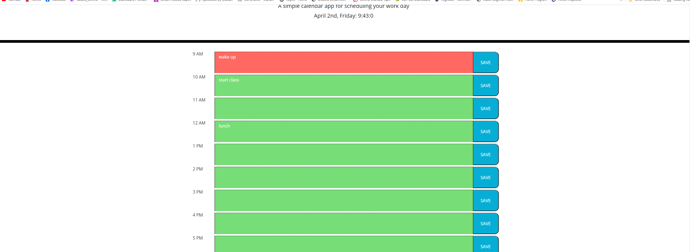

# Assigntment: Daily Planner

## Summary of assignment
-we were tasked with making a planner that would retain information in the local storage

## Languages used
-HTML was used to build the layout. Bootstrap specifically was used for making different rows and columns.
-CSS was used to style the page
-Javascript was used to implement a dynamic date, and make the page possible to interact with.

## preview of the site



## code snippet
```javascript

var currentHour = moment().format("H")
let updateTime = function () {
    let currentTime = moment().format('MMMM Do, dddd: h:mm:s')
    $("#currentDay").text(currentTime)
    }


    updateTime();


    setInterval(updateTime, 1000);
```

## my links
[Github](https://github.com/SerenaChandler),
[Linkedin](https://www.linkedin.com/in/serena-chandler-b62a39204/),
[daily planner](https://serenachandler.github.io/DailyPlanner/)